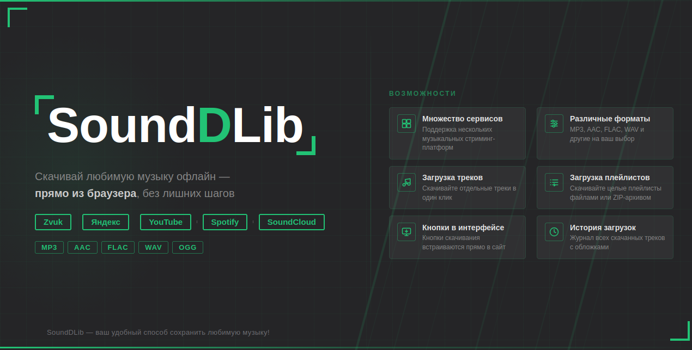

<div align="center">
  
</div>

<div align="center">

# SoundDLib

**Браузерное расширение для загрузки музыки и плейлистов со стриминговых площадок**

[](https://github.com/ivanvit/SoundDLib/actions/workflows/test.yaml)

[](https://github.com/ivanvit100/SoundDLib/actions/workflows/health-check.yaml)


[📦 Скачать](#установка) · [⚠️ Сообщить об ошибке](https://github.com/ivanvit100/SoundDLib/issues) · [✏️ Участвовать в разработке](CONTRIBUTING.md)

</div>

<div align="center">

> Хотите помочь проекту или узнать, что планируется в следующих версиях? Смотрите [CONTRIBUTING.md](CONTRIBUTING.md).

</div>

---

## О проекте

**SoundDLib** — расширение для браузера, позволяющее скачивать музыку и плейлисты с сервисов [*Звук*](https://zvuk.com/) в форматах *MP3*, *FLAC*, *OGG*, *OPUS*, *WAV* и *AAC*.

---

## Скриншоты

<div align="center">
  <table>
    <tr>
      <td align="center">
        
        <br/>
        <sub><b>Звук</b></sub>
      </td>
    </tr>
  </table>
</div>

---

## Возможности

<table>
  <tr>
    <td>⬇️ <b>В разработке</b></td>
    <td>Информация появится позже</td>
  </tr>
</table>

---

## Поддерживаемые браузеры

| Браузер | Поддержка |
|---|---|
| **Firefox** | В разработке |

---

## Установка

### Готовые сборки

1. Откройте раздел [**Releases**](https://github.com/ivanvit100/SoundDLib/releases).
2. Для **Firefox** скачайте `.xpi` файл последней версии.
3. Для **Chromium-браузеров** (Chrome, Edge, Яндекс и др.) скачайте `.crx` файл.

### Ручная установка

<details>
<summary><b>Firefox</b></summary>

1. Клонируйте репозиторий:
   ```sh
   git clone https://github.com/ivanvit100/SoundDLib
   ```
2. Откройте страницу `about:debugging` в Firefox.
3. Во вкладке **«Этот Firefox»** выберите **«Загрузить временное дополнение»**.
4. Убедитесь, что выбран файл [`manifest.firefox.json`](manifest.chrome.json) (переименуйте в `manifest.json`).

</details>

<details>
<summary><b>Chromium-браузеры</b></summary>

1. Клонируйте репозиторий:
   ```sh
   git clone https://github.com/ivanvit100/SoundDLib
   ```
2. Откройте страницу `chrome://extensions/` в браузере.
3. Включите **«Режим разработчика»**.
4. Нажмите **«Загрузить распакованное расширение»** и выберите папку проекта.
5. Убедитесь, что выбран файл [`manifest.chrome.json`](manifest.chrome.json) (переименуйте в `manifest.json`).

</details>

---

## Использование

1. Проект в разработке, инструкция появится позже

---

## Технические детали

- Больше информации в будущем.

---

## Другие проекты

- [`DownloadLib`](https://github.com/ivanvit100/DownloadLib) - загрузка тайтлов с проектов [MangaLib](https://mangalib.me/) и [RanobeLib](https://ranobelib.me/)

---

## Обратная связь

- [GitHub Issues](https://github.com/ivanvit100/SoundDLib/issues)
- Автор: [ivanvit.ru](https://ivanvit.ru)

---

<div align="center">
  <sub>SoundDLib — ваш удобный способ сохранить любимую музыку!</sub>
</div>
